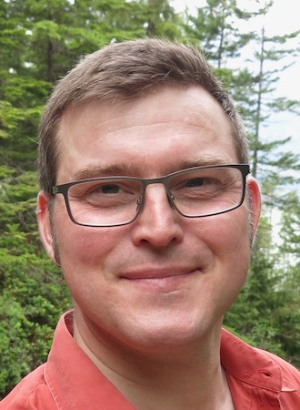

\  

Dr. Oskar Timo Thoms is a Post-doctoral Fellow at University of Toronto at Mississauga. Previously, he worked as a research and statistical consultant. In 2019-20 and summer 2022, he was an instructor at the Norman Paterson School of International Affairs, Carleton University, Ottawa. During 2018-19, he was the Simons Research Fellow in International Law and Human Security at Simon Fraser University in downtown Vancouver. He completed a Ph.D. in Politics at Princeton University (2017), where he studied international relations, comparative politics, and quantitative methods, and earned an M.A. in Sociology (2005) and a B.A. in International Development Studies (2003) at McGill University. Prior to the Ph.D., he was Research Associate at the McGill Research Group in Conflict and Human Rights (2005-06) and Visiting Research Associate at the University of Ottawa's Centre for International Policy Studies (CIPS, 2008-09), and worked as a consultant on policy research projects supported by the Canadian Department of Foreign Affairs and International Trade and the Canadian International Development Agency (now Global Affairs Canada). His academic research has focused on human rights and transitional justice, and he has co-authored scholarly articles in [*Comparative Political studies*](http://doi.org/10.1177/00104140211024305), [*Journal of Peace Research*](http://doi.org/10.1177/0022343307078943), [*Human Rights Quarterly*](http://doi.org/10.1353/hrq.2007.0034), [*Conflict &amp; Health*](http://doi.org/10.1186/1752-1505-1-11), and [*International Journal of Transitional Justice*](http://doi.org/10.1093/ijtj/ijq012) (with [Geoff Dancy](http://sites.google.com/view/geoffdancy/home), [James Ron](http://jamesron.org/), [Roland Paris](http://www.rolandparis.com/), and [Howard Ramos](http://howardramos.ca/)).

